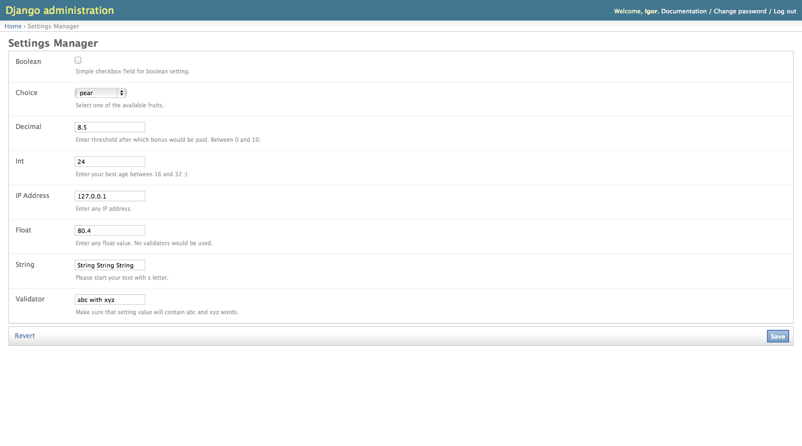

====================
Django admin support
====================

``django-setman`` has itself support of Django admin CRUD. All you need to
include ``django.contrib.admin.urls`` into your url patterns at root URLConf
module.

