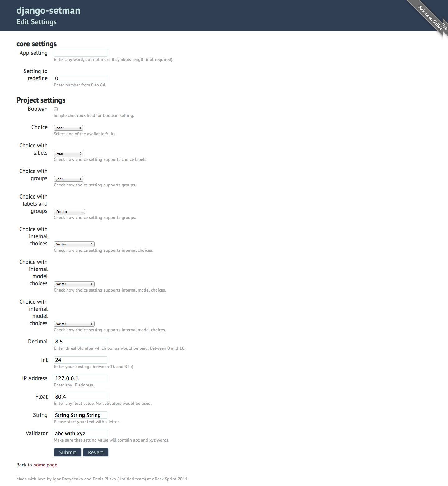

=================================
Django settings manager. Another.
=================================

The Problem
===========

Actually, maybe each Django project needs to store some custom bunch of project
specified settings.

For doing this we can just separate place where we storing them. And move its
to another Python module (so not use ``DJANGO_SETTINGS_MODULE`` for this
purpose). After we anyway will load these custom settings, like::

    from cfg.appconfig import *

It's mainly okay. But what to do, when customer will need to fast change just
one setting from the ``cfg.appconfig``?

In this case, ask customer's request to dev-team, setup new issue for this
case, create new branch by dev, fix setting value, commit changes, push the
branch to repo, ask lead to check changes and finally lead will merge fixes
to the master and deploy its to production.

Not so easy? Huh

How to Fix?
===========

First idea is simple. Let store these settings in database and give access to
the superusers do all necessary changes from the UI. And, yeah, why not use
some validators to sure that superuser entered proper values in UI.

Also, it's more better to have simple interface for reading these settings and
then updating its values from the code.

And finally, more better to read settings from database only after they changed
or invalidated cause of time and other time just read them from cache. *Really,
why we need to read settings each time per request?*

The Solution
============

Welcome ``django-setman``, simple reusable app that adds ability to store
custom settings in database and then slightly use its in code.

Database Layer
--------------

All projects settings would be stored in ``setman.Settings`` model as JSON
dump. It's easy. And mainly we don't need to know these details cause of next.

setman.settings
---------------

A simple interface for reading and storing any custom settings. With support
all values from ``django.conf.settings`` instance.

So, if earlier you needed to import Django's settings as usual::

    from django.conf import settings

Now, to use database settings, you'll need to use next statement instead::

    from setman import settings

And that's all. All other actions same. Saying you need to check list of
project admins or managers (or any other global project setting). Just write::

    from setman import settings

    def example(request):
        admins = settings.ADMINS
        managers = settings.MANAGERS
        ...

.. important: If you'll try to access attribute that does not exist in Django
   settings and doesn't available in custom settings, ``setman.settings`` will
   raise ``AttributeError`` as Django does.

And, when you need to read some value for custom setting, you'll write::

    from setman import settings

    def example(request):
        bonus_score = settings.BONUS_SCORE
        ...

And if you need to update value for custom setting, you just used ``.save()``
method::

    from setman import settings

    def example(request):
        if request.method == 'POST':
            settings.BONUS_SCORE = request.POST.get('bonus_score')
            settings.save()

That's all!

Caching Support
---------------

``django-setman`` supports caching settings to reduce number of database
queries. So, all you need to get this support, just setup ``CACHE_BACKEND`` in
global project settings.

Configuration Definition File
-----------------------------

Okay, we hope that right now, all seems clear for you. But maybe, you've
already interested how some settings being custom project settings. The answer
is with help of *configuration definition file*.

It's simple text file that next read by ``ConfigParser`` library, that uses
next format::

    [SETTING_NAME]
    type = (boolean|choice|decimal|float|int|string)
    default = <default>
    label = Setting
    help_text = Short description about setting.
    validators = path.to.validator

By default, this file should be placed in same directory where
``DJANGO_SETTINGS_MODULE`` located, but you can customize things by changing
``SETMAN_SETTINGS_FILE`` value in your project settings.

And, don't worry if you haven't ``settings.cfg`` and you've already installed
``setman``, all will work fine and ``setman`` just sends all errors to the
logger. And don't raise any errors when configuration definition file doesn't
exist or cannot parse.

UI
--

And the main feature of ``setman`` is simple UI for editing all custom project
settings. It could be well configured for use with project styles or with
standard Django admin styles.

For enabling UI, you'll need to include setman urls in your root URLConf
module::

    urlpatterns = patterns('',
        ...
        (r'^setman/', include('setman.urls')),
        ...
    )

Next, you need to setup who permitted to access "Edit Settings" page from UI.
By default, only superusers can have access to this page. But you can customize
things providing ``SETMAN_AUTH_PERMITTED`` trigger in project settings::

    SETMAN_AUTH_PERMITTED = lambda user: user.is_staff

Make sure, that is lambda or callable object that would be called with one
argument. This argument would be standard user instance from ``request.user``
var, so you can allow to edit settings for any logged in user with next
statement::

    SETMAN_AUTH_PERMITTED = lambda user: user

And finally, feel free to run development server and go to the setman UI. In
test project it looks next.

More
====

For more information check next links,

.. toctree::
   :maxdepth: 2

   using
   config
   settings
   admin
   api

Authors. License. Code
======================

``django-setman`` was created by Igor Davydenko and Denis Plisko (Untitled
team) at the oDesk Sprint 2011.

The library licensed under the BSD License.

Source code available at `GitHub
<https://github.com/odeskps/django-setman>`_.
